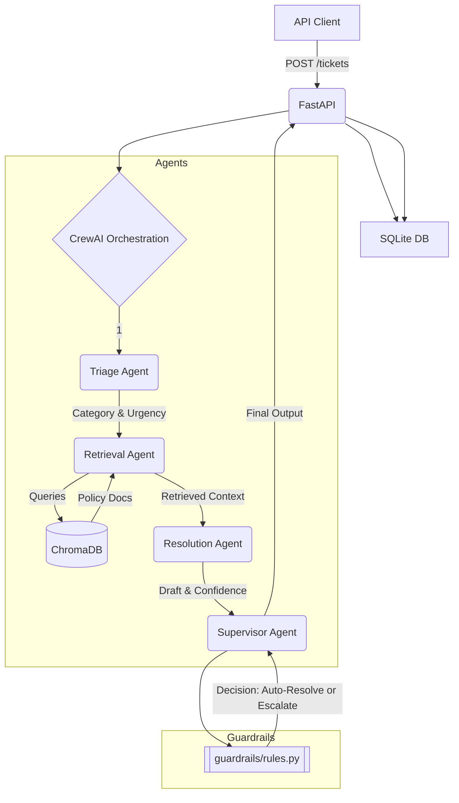

# TriageCrew: Multi-Agent Enterprise Support & Escalation System

TriageCrew is a multi-agent system that mirrors how a real support organization is structured. It uses coordinating AI agents to handle incoming support tickets by triaging them, searching a knowledge base, drafting a resolution, and finally applying deterministic guardrails to decide whether to auto-resolve the ticket or escalate it to a human. This project demonstrates how to build agentic systems with defined tools, reasoning, and guardrails, exposed as production-style services rather than single monolithic prompts.

## Architecture



## Setup Instructions

1. **Clone the repository.**
2. **Configure environment variables:**
   Copy `.env.example` to `.env` and fill in your API keys:
   ```bash
   cp .env.example .env
   # Edit .env to add OPENAI_API_KEY (or use LiteLLM compatible keys) and API_KEY
   ```
3. **Run with Docker:**
   ```bash
   docker-compose up --build
   ```
   This will automatically run the seed script to load synthetic tickets into SQLite and policy documents into ChromaDB, and start the FastAPI server on `localhost:8000`.

## Observability & Operations

The system is instrumented with:
- **LangSmith Tracing:** For deep inspection of agent execution, tool calls, and LLM payloads.
- **Datadog APM & StatsD:** For service-level performance monitoring and custom business metrics (e.g., ticket resolution outcomes vs escalations).
- **Kubernetes:** A complete set of deployment manifests is available in `k8s/`.

For a full guide on deploying this system, configuring the dashboards, and simulating an incident via Rootly, see the [RUNBOOK.md](./RUNBOOK.md).

## Worked Example

**Input (POST /tickets):**
```json
{
  "subject": "Can I get a refund for the last invoice? I canceled my account before the billing date.",
  "body": "I was charged even though I canceled.",
  "customer_id": "CUST-390"
}
```

**Output (GET /tickets/{id}):**
```json
{
  "status": "escalated",
  "category": "Billing",
  "urgency": "Low",
  "resolution": {
    "decision": "escalate",
    "matched_rule": "always_escalate_billing",
    "draft_response": "...",
    "confidence": 0.9,
    "reason": "Escalated by supervisor due to billing category."
  },
  "agent_trace": [
    { "agent_name": "Support Ticket Classifier", "output": "..." },
    { "agent_name": "Knowledge Base Researcher", "output": "..." },
    ...
  ]
}
```

## Test Coverage Summary

The system is covered by **25+ tests** spanning unit logic, guardrail rules, and API endpoints. 
- **Agent tests:** Verifies agent instantiation, tool configurations, and expected schemas.
- **Guardrail tests:** Pure python logic tests covering every deterministic branch (low confidence, missing knowledge, flagged keywords) independent of LLM calls.
- **API and Integration tests:** Validates FastAPI responses, API key middleware, and mocked Crew orchestration.

## Honest Limitations

- **State Management:** The current implementation uses SQLite for both ticket tracking and agent step persistence. SQLite does not survive multi-replica Kubernetes deployments; a production deployment would require an external Postgres database.
- **Confidence Scores:** The confidence scores from the Resolution Agent are LLM-self-reported heuristics, not calibrated statistical probabilities.
- **Synthetic Data:** The provided support queries and policy documents are synthetic, and performance numbers should not be generalized to production without evaluation on real data.
- **Synchronous Execution:** For MVP simplicity, the `POST /tickets` endpoint handles the entire agent loop synchronously. This means latency can be upwards of 15-20 seconds. 
- **Keyword Filtering:** The guardrail keyword list is a small illustrative set. A real system would need a robust, possibly ML-assisted flagged-term list.

## What I'd do differently at enterprise scale

At enterprise scale, synchronous processing of tickets via a single FastAPI endpoint is unscalable and prone to timeout errors. I would redesign the architecture to be **asynchronous and event-driven**, utilizing a message broker like **RabbitMQ or Kafka** and background workers (e.g. Celery). The `POST /tickets` endpoint would simply enqueue the ticket and return a `202 Accepted` status, and webhooks/WebSockets would notify the client when processing is complete.

Furthermore, I would implement **multi-tenant data isolation** via row-level security (RLS) in PostgreSQL instead of SQLite, and move from purely heuristic confidence scores to a calibrated classification model (or at least logprobs-based confidence via the OpenAI API) to better tune the escalation threshold.
